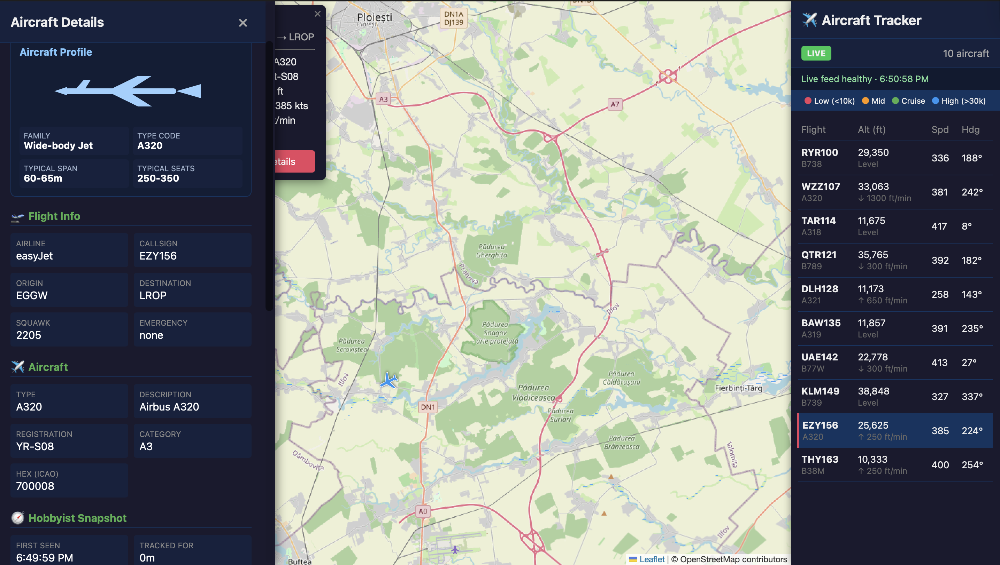

# Signal ADS-B Tracker

A full-stack ADS-B tracker that combines live aircraft data, simulation mode, and hobbyist-focused aircraft insights.



## The What

This project demonstrates:

- Hardware/data ingestion (dump1090 ADS-B feed)
- Backend API design and reliability (Flask + structured error handling)
- Frontend geospatial UI (Leaflet map + rich detail panel)
- Domain-specific features (aircraft history, trail rendering, hobbyist links)
- Persistence engineering (SQLite storage with retention controls)
- Testing discipline (pytest suite)

## Features

- Live tracking from dump1090 JSON feed
- Built-in simulation mode for demos without hardware
- Automatic fallback to simulation when live feed is missing
- Aircraft markers with heading + altitude-based coloring
- Rich aircraft detail panel
- Per-aircraft history trail and derived stats:
  - tracked duration
  - max altitude
  - max speed
  - estimated distance traveled
- SQLite persistence for metadata, stats, and history
- Retention window for historical records
- API endpoints for UI and debugging

## Tech stack

- Backend: Python + Flask
- Frontend: Vanilla JavaScript + Leaflet
- Storage: SQLite
- Testing: pytest

## Quick start (simulation)

```bash
python3 -m venv .venv
source .venv/bin/activate
pip install -r requirements.txt

export SIMULATION_MODE="true"
python app.py
```

Open http://localhost:5001

## Quick start (live feed)

1. Run dump1090 and write JSON output.
2. Set feed path and disable forced simulation.

```bash
export SIMULATION_MODE="false"
export DUMP1090_JSON_PATH="/tmp/dump1090/aircraft.json"
python app.py
```

## Configuration

Environment variables:

- `SIMULATION_MODE` (default: `false`)
- `AUTO_SIMULATION_WHEN_NO_FEED` (default: `true`)
- `SIMULATED_AIRCRAFT_COUNT` (default: `10`)
- `SIMULATION_CENTER_LAT` (default: `44.4268`)
- `SIMULATION_CENTER_LON` (default: `26.1025`)
- `DUMP1090_JSON_PATH` (default: `/tmp/dump1090/aircraft.json`)
- `METADATA_API_URL` (default: airplanes.live hex endpoint)
- `REQUEST_TIMEOUT_SECONDS` (default: `3`)
- `DB_PATH` (default: `data/signal_tracker.db`)
- `HISTORY_RETENTION_HOURS` (default: `24`)
- `FLASK_HOST` (default: `0.0.0.0`)
- `FLASK_PORT` (default: `5001`)
- `FLASK_DEBUG` (default: `false`)
- `LOG_LEVEL` (default: `INFO`)

## API endpoints

- `GET /` - UI
- `GET /data` - live/sim aircraft payload
- `GET /status` - mode + runtime health + persistence info
- `GET /aircraft/<hex>/details` - detailed aircraft stats/history

## Tests

```bash
pytest -q
```

## Persistence model

The app persists three data domains:

- `aircraft_metadata` - operator/type/registration lookup cache
- `aircraft_stats` - rolling per-aircraft aggregate metrics
- `aircraft_history` - time-series trajectory snapshots

On startup, persisted state is loaded into memory so history survives restarts.

## Tomorrow demo flow (3-4 minutes)

1. Start in simulation mode and show moving traffic.
2. Click one aircraft and explain profile + hobbyist metrics.
3. Show route trail and external hobbyist links.
4. Open `/status` to explain mode and persistence metadata.
5. Restart app and show that history/statistics persist.

## Project structure

```text
app.py
static/
  script.js
  style.css
templates/
  index.html
tests/
  test_app.py
data/
  signal_tracker.db
```
